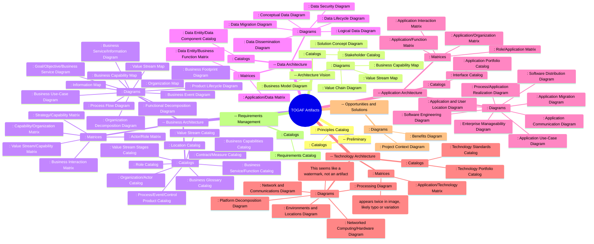

```mermaid
mindmap
  root((TOGAF Artifacts))

    -- Preliminary
      : Catalogs
        : Principles Catalog

    -- Architecture Vision
      : Catalogs
        : Stakeholder Catalog
      : Diagrams
        : Value Chain Diagram
        : Solution Concept Diagram
        : Business Model Diagram
        : Business Capability Map
        : Value Stream Map

    -- Business Architecture
      : Catalogs
        : Organization/Actor Catalog
        : Role Catalog
        : Business Service/Function Catalog
        : Location Catalog
        : Process/Event/Control Product Catalog
        : Contract/Measure Catalog
        : Business Capabilities Catalog
        : Value Stream Catalog
        : Value Stream Stages Catalog
        : Business Glossary Catalog
      : Matrices
        : Business Interaction Matrix
        : Actor/Role Matrix
        : Value Stream/Capability Matrix
        : Strategy/Capability Matrix
        : Capability/Organization Matrix
      : Diagrams
        : Business Footprint Diagram
        : Business Service/Information Diagram
        : Functional Decomposition Diagram
        : Product Lifecycle Diagram
        : Goal/Objective/Business Service Diagram
        : Business Use-Case Diagram
        : Organization Decomposition Diagram
        : Process Flow Diagram
        : Business Event Diagram
        : Business Capability Map
        : Value Stream Map
        : Organization Map
        : Information Map

    -- Data Architecture
      : Catalogs
        : Data Entity/Data Component Catalog
      : Matrices
        : Data Entity/Business Function Matrix
        : Application/Data Matrix
      : Diagrams
        : Conceptual Data Diagram
        : Logical Data Diagram
        : Data Dissemination Diagram
        : Data Security Diagram
        : Data Migration Diagram
        : Data Lifecycle Diagram

    -- Application Architecture
      : Catalogs
        : Application Portfolio Catalog
        : Interface Catalog
      : Matrices
        : Application/Organization Matrix
        : Role/Application Matrix
        : Application/Function Matrix
        : Application Interaction Matrix
      : Diagrams
        : Application Communication Diagram
        : Application and User Location Diagram
        : Application Use-Case Diagram
        : Enterprise Manageability Diagram
        : Process/Application Realization Diagram
        : Software Engineering Diagram
        : Application Migration Diagram
        : Software Distribution Diagram

    -- Technology Architecture
      : Catalogs
        : Technology Standards Catalog
        : Technology Portfolio Catalog
      : Matrices
        : Application/Technology Matrix
        : Application/Technology Matrix (appears twice in image, likely typo or variation)
      : Diagrams
        : Environments and Locations Diagram
        : Platform Decomposition Diagram
        : Processing Diagram
        : Networked Computing/Hardware Diagram
        : Network and Communications Diagram
        : The Open Group (This seems like a watermark, not an artifact)

    -- Opportunities and Solutions
      : Diagrams
        : Project Context Diagram
        : Benefits Diagram

    -- Requirements Management
      : Catalogs
        : Requirements Catalog
```
